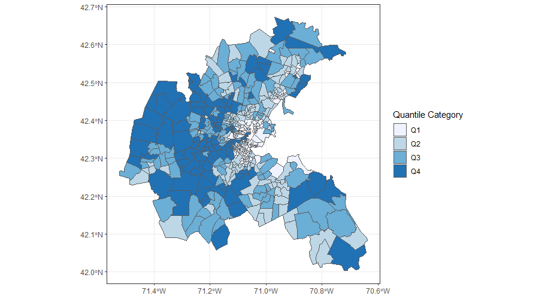
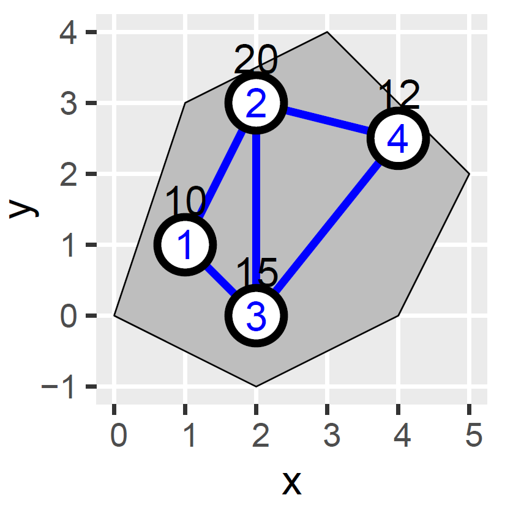
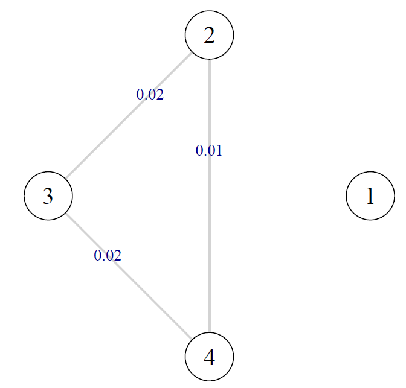

# Introduction

Nearby locations in space often exhibit strong spatial relationships. Due to this, for spatial clusters to be meaninful, they are often required to be spatially contiguous. Similar spatial patterns can also emerge at distant locations in space as patches (not in proximity), which are referred to as repeated spatial clusters.

An ideal spatial clustering framework:
- Should form spatially contiguous clusters.
- Should identify repeated spatial clusters.

  
  
Figure 1: Median house prices in Boston city

Figure 1 shows that suburbs in Q4 creates spatiallly conitguous clusters. There are also a few suburbs belonging to Q4 that appear at distant locations resembling repeated spatial clusters.

There are various clustering algorithms used in spatial clustering, but they have thier own challenges.

Clustering algorithms that only use attributes (including spatial attributes) result in non-contiguous clusters:
1. K-Means Clustering.
2. Hierarchical Clustering.

Regionalization clustering ensures spatially cohesive clusters but does not identify repeated spatial patterns:
1. Density Based Spatial Clustering of Application with Noise (DBSCAN).
2. Constrained Hierarchical Clustering.

# Methods

The data we work on this project:
- \\(\textit{\textbf{X}}(s) \in \mathbb{R}^{n \times p}\\)
- \\(s \in \mathcal{D} \subset \mathbb{R}^{d}, d = 2\\)

The primary objective of this project is to develop a framework for identifying repeated spatial clusters while accounting for spatial dependence and contiguity. This is achieved by:
1. Identifying spatially contiguous clusters (Constrained Agglomerative Hierarchical Clustering is used for this step).
2. Perform a nonparametric spatial invariance test to identify repeated spatial patterns.
3. Re-partition the clusters based on the spatial invariance test results.

### Constrained Agglomerative Hierarchical Clustering (CAHC)

This is an extension of the standard agglomerative hierarchical clustering, where we can define contiguity constraints to guide the clustering process. Consider the follwing toy example shown in Figure 2.

  
  
Figure 2: X(1)=10, X(2)=20, X(3)=15, X(4)=12 with spatial locations 1, 2, 3, 4. The "must-links" created by the 2-nearest neighborhood structure are presented as edges.

The following two tables show the distance matrix (left) and the must-link constraints (right).

<table>
  <tr>
    <th>Location</th>
    <th>1</th>
    <th>2</th>
    <th>3</th>
  </tr>
  <tr>
    <td>2</td>
    <td>10</td>
    <td></td>
    <td></td>
  </tr>
  <tr>
    <td>3</td>
    <td>5</td>
    <td>5</td>
    <td></td>
  </tr>
  <tr>
    <td>4</td>
    <td>2</td>
    <td>8</td>
    <td>3</td>
  </tr>
</table>

<table>
  <tr>
    <th>From</th>
    <th>To</th>
    <th>Distance</th>
  </tr>
  <tr>
    <td>1</td>
    <td>2</td>
    <td>10</td>
  </tr>
  <tr>
    <td>1</td>
    <td>3</td>
    <td>5</td>
  </tr>
  <tr>
    <td>2</td>
    <td>3</td>
    <td>5</td>
  </tr>
  <tr>
    <td>2</td>
    <td>4</td>
    <td>8</td>
  </tr>
  <tr>
    <td>3</td>
    <td>4</td>
    <td>3</td>
  </tr>
</table>

In standard agglomerative hierarchical clustering, we merge the two observations with the smallest distance between them. In this example, the smallest distance is 3, between locations 1 and 4. In constrained agglomerative hierarchical clustering, we also have consider the must-links constraints. At a given merging step, we need to merge the two locations with the smallest distance that has a link between them. So for this example, we need to merge the locations 3 and 4 at the first merging step. This newly created cluster inherits all the links of location 3 and 4. This process continues until all locations are merged into a single cluster or until all contiguity constraints are satisfied. 

### Maximum Mean Discrepancy

We use the Maximum Mean Discrepancy (MMD) statistic with block permutation for conducting spatial invariance test to identify repeated spatial patterns. We perform this test on all distinct pairs of clusters obtained from applying the CAHC. 

We test the following null hypothesis:
- \\(\mathcal{H}_{0}\\): The tested Pair of clusters is spatially invariant.

The MMD\\(^{2}\\) quantifies the difference between the means of feature embeddings in a high-dimensional space. Let \\(\textit{\textbf{x}}\\) and \\(\textit{\textbf{y}}\\) be two samples from distributions \\(P\\) and \\(Q\\).

$$\text{MMD}^{2}(P,Q) = \bigl|\bigl|\mathbb{E}_{\textit{\textbf{X}}\sim P}(\phi(\textit{\textbf{x}}))-\mathbb{E}_{\textit{\textbf{Y}}\sim Q}(\phi(\textit{\textbf{y}}))\bigr|\bigr|_{\mathcal{H}_{k}}^{2},$$

- \\(\mathcal{H}_{k}\\): Reproducing Kernel Hilbert Space (RKHS) associate with a kernel function \\(k(\cdot, \cdot)\\).
- \\(\phi(\cdot)\\): Feature map to a RKHS.

The kernel function calculates the similarity between two data points in a high dimensional space without explicitly mapping the data points into that space. This also allows us to estimate the MMD\\(^{2}\\) without explicitly mapping the data points into a high dimensional space.

Rationale for selecting MMD as the test statistic:
- Does not require any distributional assumption on data.
- Robust to weak dependencies between observations.
- Provides flexibility to use different kernels, which could capture wide range of differences between distributions when testing for spatial invariance.

### Re-partitioning of the Clusters

As the final step, we re-partition the clusters obtained from CAHC based on the pairwise spatial invariance test. We present the pairwise test results in a graph, which guides re-partitioning procedure. Since this test involves multiple comparisons, we use the false discovery rate at a 0.05 significance level.

  
  
Figure 3: Graph based on pairwise test results for 5 clusters.

- Nodes: Clusters obtained from CAHC.
- Edges: Connect clusters with similar distributions.
- Edge Label: Observed MMD\\(^{2}\\) between two clusters.

\\(\textit{Rule of thumb}\\): Merge clusters that create fully connected sub-graphs.

# Application on Spatial Omics Data

